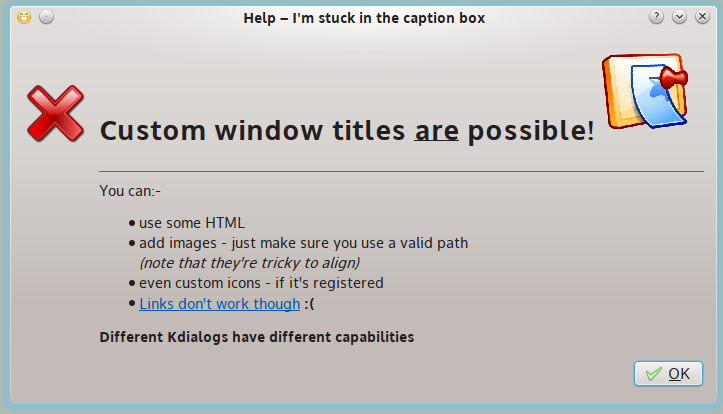

Nim-KDialog
===========

Use
---

.. code:: nim

  import kdialog

  echo yesno "Love Nim?"
  echo yesnocancel "Is Nim Awesome?"
  echo warningyesno "Update Nimble index!"
  echo warningcontinuecancel "Nimble is Up-to-date!"
  echo warningyesnocancel "Contribute to Nim today?"
  echo sorry "We got no Interfaces..."
  echo error "Your Nim does not compile!"
  echo newpassword "Enter some Password here"
  echo getcolor "Which is the best color?"
  echo calendar "When is the next eclipse?"

Return Types
------------

All Dialogs are pre-parsed into proper Nim Types!.

- The Color Picker returns a ``Color`` type from ``colors`` module.
- The Date Picker returns a ``DateTime`` type from ``times`` module.
- Boolean, integer or string are returned when fits.

Why not a proper GUI Toolkit?
-----------------------------

- This is oriented to newbiews, teaching programming classes, hackattons, etc.
- KISS principle, easy to use, simple API, Nim need GUI, this is **~32Kb compiled**.
- KDEs Documentation works for this module since its 1:1 clone. Has builtin Examples.
- The idea is to help people move from procedural Bash to Nim with GUI.
- I tried using `dialog`, `whiptail`, they both fail because kinda buggy.
- I tried using `xdialog`, `gdialog` they both fail, mostly spamm polluting output with useless GTK warnings.

Requisites
----------

- KDialog and Qt5.
- Nim and Nimble.

Install
-------

- ``nimble install kdialog``
